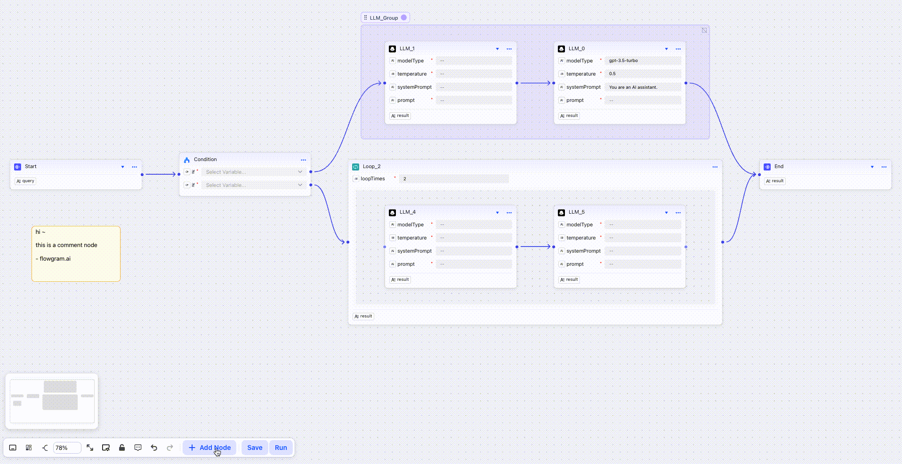

<div align="center">

[](https://github.com/bytedance/flowgram.ai/blob/main/LICENSE) [](https://www.npmjs.com/package/@flowgram.ai/editor) [](https://deepwiki.com/bytedance/flowgram.ai) [](https://juejin.cn/column/7479814468601315362)

[](https://trendshift.io/repositories/13877)

</div>

# FlowGram | Marco de desarrollo de flujos de trabajo

[English](README.md) | [中文](README_ZH.md) | [Español](README_ES.md) | [Русский](README_RU.md) | [Português](README_PT.md) | [Deutsch](README_DE.md) | [日本語](README_JA.md)

FlowGram es un marco y conjunto de herramientas de desarrollo de flujos de trabajo componible, visual, fácil de integrar y extensible.
Nuestro objetivo es ayudar a los desarrolladores a crear plataformas de flujo de trabajo de IA de forma **más rápida** y **sencilla**.
FlowGram viene con un conjunto de herramientas integradas para el desarrollo de flujos de trabajo: un lienzo de flujo visual, formularios de configuración de nodos, una cadena de alcance de variables y materiales listos para usar (LLM, Condición, Editor de código, etc.). No es una plataforma de flujo de trabajo ya hecha; es el marco y el conjunto de herramientas para crear la suya.

Obtenga más información en 🌐 [FlowGram.AI](https://flowgram.ai)

## 🎬 Demostración

<https://github.com/user-attachments/assets/fee87890-ceec-4c07-b659-08afc4dedc26>

[Abrir en CodeSandbox](https://codesandbox.io/p/github/louisyoungx/flowgram-demo/main?import=true)

En esta demostración, iteramos a través de una lista de ciudades, obtenemos el clima en tiempo real a través de HTTP, analizamos las temperaturas con un nodo de código, generamos sugerencias de atuendos con un LLM, controlamos mediante una condición, agregamos los resultados a lo largo del bucle y, finalmente, usamos un LLM asesor para elegir la ciudad más cómoda antes de enviar el resultado al nodo final.

## 🚀 Inicio rápido

1. Cree un nuevo proyecto de FlowGram con plantillas preestablecidas

```sh
npx @flowgram.ai/create-app@latest
```

⭐️ Se recomienda elegir `Free Layout Demo`

2. Inicie el proyecto

```sh
cd demo-free-layout
npm install
npm start
```

3. Abra el navegador

¡Disfrútelo! [http://localhost:3000](http://localhost:3000)

## ✨ Características

| Característica                                                                                 | Descripción                                                                                                                                                                                            | Demostración                                                                                   |
| ---------------------------------------------------------------------------------------------- | ------------------------------------------------------------------------------------------------------------------------------------------------------------------------------------------------------ | ---------------------------------------------------------------------------------------------- |
| [Lienzo de diseño libre](https://flowgram.ai/examples/free-layout/free-feature-overview.html)  | Lienzo de diseño libre donde los nodos se pueden colocar en cualquier lugar y conectar mediante líneas de forma libre.                                                                                 |        |
| [Lienzo de diseño fijo](https://flowgram.ai/examples/fixed-layout/fixed-feature-overview.html) | Lienzo de diseño fijo donde los nodos se pueden arrastrar a posiciones específicas, con soporte para nodos compuestos como ramas y bucles.                                                             |       |
| [Formulario](https://flowgram.ai/examples/node-form/basic.html)                                | Formularios integrados y Formulario mantiene las operaciones CRUD de datos de nodos y proporciona capacidades para renderizado, validación, efectos secundarios, vinculación de lienzo/variables, etc. |  |
| [Variable](https://flowgram.ai/guide/variable/basic.html)                                      | Las variables declarativas desempeñan un papel similar al de los "conectores". Son los "mensajeros" que se utilizan para pasar información entre diferentes nodos.                                     |    |


## 📖 Documentación

Puede encontrar la documentación de FlowGram [en el sitio web](https://flowgram.ai).

La documentación se divide en varias secciones:

- [Inicio rápido](https://flowgram.ai/guide/getting-started/install.html)
- [Lienzo](https://flowgram.ai/guide/free-layout/load.html)
- [Formulario](https://flowgram.ai/guide/form/form.html)
- [Variable](https://flowgram.ai/guide/variable/basic.html)
- [Material](https://flowgram.ai/materials/introduction.html)
- [Tiempo de ejecución](https://flowgram.ai/guide/runtime/introduction.html)
- [Guías avanzadas](https://flowgram.ai/guide/advanced/zoom-scroll.html)
- [Referencia de la API](https://flowgram.ai/api/index.html)
- [Dónde obtener soporte](https://flowgram.ai/guide/contact-us.html)

## 🙌 Colaboradores

[](https://github.com/bytedance/flowgram.ai/graphs/contributors)

## 🌍 Adopción

- [Coze Studio](https://github.com/coze-dev/coze-studio) es una herramienta de desarrollo de agentes de IA todo en uno. Coze Studio, que proporciona los últimos modelos y herramientas grandes, varios modos y marcos de desarrollo, ofrece el entorno de desarrollo de agentes de IA más conveniente, desde el desarrollo hasta la implementación.
- [NNDeploy](https://github.com/NNDeploy/nndeploy) es una herramienta de implementación de IA multiplataforma basada en flujos de trabajo.
- [Certimate](https://github.com/certimate-go/certimate) es una herramienta de gestión de certificados SSL de código abierto que le ayuda a solicitar e implementar automáticamente certificados SSL con un flujo de trabajo visual. Es una de las opciones de cliente ACME que se enumeran en la documentación oficial de Let's Encrypt.

## 📬 Contáctenos

- Problemas: [Problemas](https://github.com/bytedance/flowgram.ai/issues)
- Lark: Escanee el código QR a continuación con [Registrar Feishu](https://www.feishu.cn/en/) para unirse a nuestro grupo de usuarios de FlowGram.


